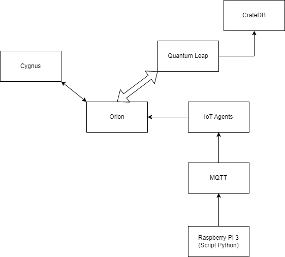
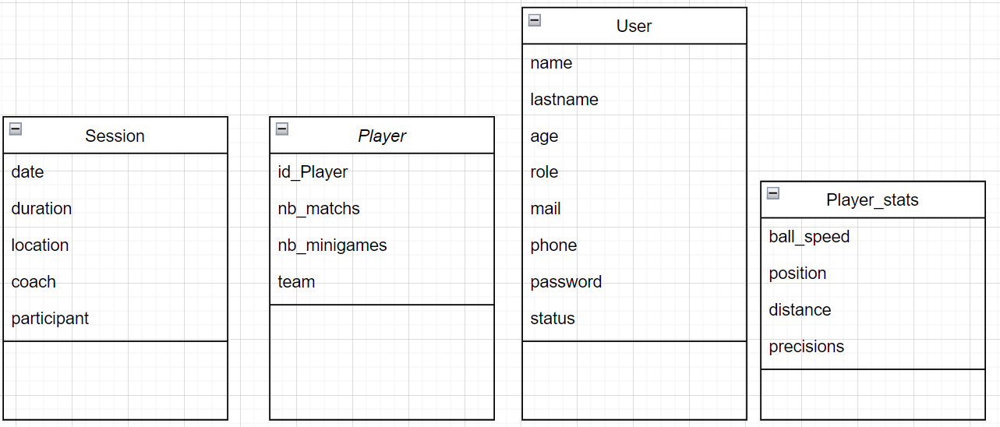

## Études et choix techniques

Dans le cadre du développement de Co'B, plusieurs choix techniques ont été réalisés afin de garantir une intégration optimale des différentes technologies et une performance maximale du dispositif. Voici un aperçu des principales décisions technologiques :

### Infrastructure et gestion des contextes

**Docker et Portainer :**
   - Pour faciliter la gestion des conteneurs et déployer facilement nos services, nous avons opté pour Docker, accompagné de Portainer pour une interface de gestion intuitive. Cette solution nous permet de maintenir une architecture modulaire et scalable.
   - **Avantages :** Isolation des services, facilité de déploiement, gestion simplifiée des mises à jour et des versions.

**Orion Context Broker :**
   - Nous utilisons Orion Context Broker pour une gestion avancée des contextes en temps réel. Il nous permet de collecter, gérer et fournir des données contextuelles à partir de divers capteurs et dispositifs connectés.
   - **Avantages :** Flexibilité, temps réel, interopérabilité avec d'autres composants FIWARE.

### Intégration des capteurs

**IoT Agents :**
   - Pour une meilleure intégration des différentes technologies de capteurs, nous avons intégré des IoT Agents. Ceux-ci facilitent la communication entre les capteurs et Orion Context Broker en traduisant les protocoles spécifiques des capteurs en formats compatibles avec FIWARE.
   - **Avantages :** Compatibilité accrue, facilité d'intégration, gestion unifiée des capteurs.

### Analyse temporelle et traitement de données

**QuantumLeap et CrateDB :**
   - Pour effectuer une analyse temporelle approfondie des données, nous avons choisi QuantumLeap en combinaison avec CrateDB. QuantumLeap permet de transformer les données contextuelles en séries temporelles, tandis que CrateDB offre une base de données adaptée au stockage et à l'analyse des séries temporelles.
   - **Avantages :** Performance, scalabilité, efficacité dans le traitement des séries temporelles.

**Cygnus :**
   - Pour la gestion des flux de données entre les différents composants FIWARE et les bases de données externes, nous avons intégré Cygnus. Cygnus facilite le transfert des données collectées vers divers systèmes de stockage et de traitement.
   - **Avantages :** Interopérabilité, gestion efficace des flux de données, compatibilité avec divers systèmes de stockage.

### Protocole de Communication

**Protocole MQTT :**
   - Pour la communication entre le Raspberry Pi 3 et les IoT Agents, nous utilisons le protocole MQTT (Message Queuing Telemetry Transport). MQTT est un protocole de messagerie léger conçu pour les connexions de machine à machine (M2M) et les environnements de l'Internet des objets (IoT).
   - **Avantages :** Faible bande passante, fiabilité, efficacité dans les environnements à faible latence, compatibilité avec les capteurs IoT.

### Choix Matériels

 Nous avons choisi le Raspberry Pi 3 pour notre projet en raison de ses nombreux avantages par rapport à une carte Pycom. Voici un comparatif détaillé des deux options :

   - **Raspberry Pi 3 :**
     - **Processeur :** Quad-core 1.2 GHz Broadcom BCM2837 64-bit CPU
     - **Mémoire :** 1 GB RAM
     - **Connectivité :** Wi-Fi 802.11n, Bluetooth 4.1, Ethernet
     - **Ports :** 4 ports USB, 1 port HDMI, GPIO
     - **Support Communautaire :** Très large communauté avec de nombreuses ressources disponibles
     - **Avantages :** Puissance de calcul, compatibilité avec divers modules et capteurs, coût abordable, large support communautaire.

   - **Pycom :**
     - **Processeur :** Dual-core 32-bit LX6 microprocessor (Espressif ESP32)
     - **Mémoire :** 520 KB RAM, 4 MB Flash
     - **Connectivité :** Wi-Fi, Bluetooth, Sigfox, LoRa, LTE (selon le modèle)
     - **Ports :** Moins de ports que le Raspberry Pi, spécifiquement orienté IoT
     - **Support Communautaire :** Communauté active mais plus restreinte que celle du Raspberry Pi
     - **Avantages :** Excellente pour les projets IoT nécessitant des connexions spécifiques comme Sigfox ou LoRa, faible consommation d'énergie.

   - **Décision :** Nous avons opté pour le Raspberry Pi 3 en raison de sa polyvalence, de sa puissance de calcul supérieure, de sa compatibilité avec une large gamme de modules et capteurs, et de son support communautaire étendu. Bien que la carte Pycom soit excellente pour des projets IoT spécifiques, le Raspberry Pi 3 offre une solution plus complète et flexible pour les besoins de notre projet, sachant que nous n'utilisons pas de réseau LoRa, Sigfox ou autre.

**Capteur de Distance :**
   -  Pour détecter le passage du ballon dans l'arceau, nous utilisons un capteur de distance. Ce capteur permet de mesurer avec précision la distance entre le ballon et le panier, fournissant des données essentielles pour l'analyse des tirs.
   - **Avantages :** Précision, fiabilité, facilité d'intégration avec le Raspberry Pi.

## Diagrammes illustratifs
Voici quelques diagrammes pour illustrer le fonctionnement de Co'B :

### Diagramme de fonctionnement

### Diagramme de bloc

### Conclusion

Les choix techniques réalisés pour le projet Co'B visent à assurer une intégration fluide et une performance optimale du système. En combinant des technologies avancées de gestion des contextes, d'intégration des capteurs, d'analyse temporelle et de traitement des flux de données, nous avons construit une solution robuste et évolutive pour l'entraînement au basketball. L'utilisation du Raspberry Pi 3 et des capteurs de distance garantit une solution matérielle efficace et abordable, adaptée aux besoins de notre projet.
