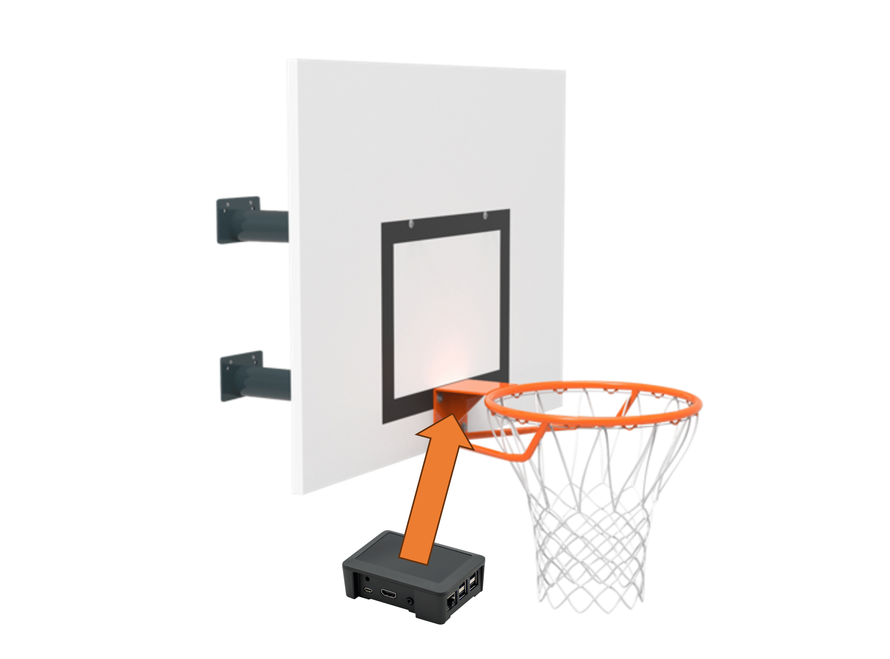

# Co'b Project

Bienvenue sur le projet **Co'b (Connected Basket)**, une innovation révolutionnaire conçue pour transformer l'entraînement au basketball.

## À propos du Projet

Co'b est le fruit du travail de **Louis, Adrian et Gianni**, deux ingénieurs en informatique passionnés de basketball. Ce projet a pour objectif de répondre à un besoin non satisfait : fournir des outils d'analyse de performance abordables et personnalisés pour les joueurs de tous niveaux.

En exploitant la technologie de l'intelligence artificielle, Co'b propose un dispositif connecté qui se fixe sur n'importe quel panier de basket. Ce dispositif analyse les tirs et offre :

- Des **statistiques personnalisées**
- Des **conseils d'amélioration**
- Des **défis ludiques**

Ces fonctionnalités sont accessibles via une application mobile/web facile à utiliser.

## Vidéo Présentation

<iframe width="560" height="315" src="https://www.youtube.com/embed/Y20hAHf7zNk?si=UrO35O-r6UlEBWZC" title="YouTube video player" frameborder="0" allow="accelerometer; autoplay; clipboard-write; encrypted-media; gyroscope; picture-in-picture; web-share" referrerpolicy="strict-origin-when-cross-origin" allowfullscreen></iframe>

---
